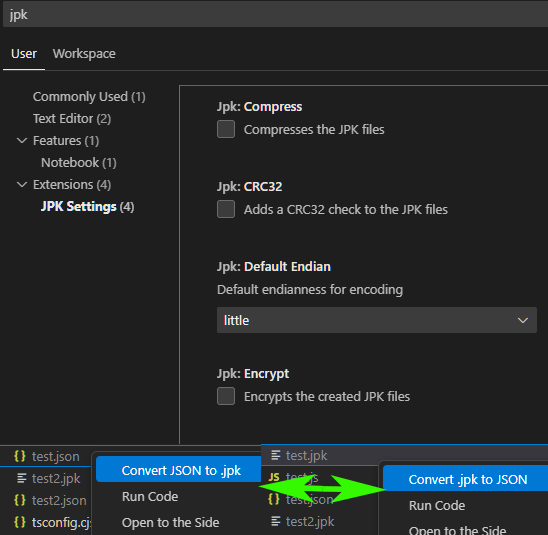

# 🧰 JPK JSON Tools — VS Code Extension


[`JamPak`](https://github.com/hearhellacopters/jampak) is an efficient file storage solution specifically made for both JavaScript and TypeScript data types in Node.js with a focus on accuracy, expandability, security, and performance. Includes compact storage of all JSON types as well as `TypedArrays`, `Maps`, `Sets`, `Dates`, `Symbols` and more! This library uses a heavily modified implementation of [MessagePack](https://github.com/msgpack/msgpack/blob/master/spec.md) using [BiReader](https://github.com/hearhellacopters/bireader) to improve storage size and create efficient binary serialization.

**JamPak** improvements over MessagePack:
 - Reduced file size by spliting data into two sections, **values** and **strings**
 - Keys can be stripped for 'schemas' like control to futher reduce file size and added security
 - Compression / Encryption / CRC check
 - Endianness control

> This extension allows you to easily convert between `.jpk` binary JSON files and human-readable `.json` files directly in Visual Studio Code.

---

## ✨ Features

* 📂 Open `.jpk` files and view/edit as formatted JSON
* 💾 Save changes back to `.jpk` format
* 🖱️ Right-click context menu:

  * Convert `.jpk` ➜ `.json`
  * Convert `.json` ➜ `.jpk`
* ⚙️ Customizable settings including compression, encryption and CRC32 hash.

---

## 🚀 Getting Started

1. **Install** the extension from the VS Code Marketplace
2. **Right-click** on any `.json` file to convert it to a `.jpk` file
3. **Right-click** on any `.jpk` file to convert it to a `.json` file

---

## 📃 Examples

### Convert JPK to JSON

Right-click on any `.jpk` file in the explorer and select:

```
Convert .jpk to JSON
```

This will create a `.json` version next to it with the decoded content.

### Convert JSON to JPK

Right-click on a `.json` file and choose:

```
Convert JSON to .jpk
```

A new `.jpk` binary file will be generated using the current settings.

---

## ⚙️ Extension Settings

You can configure behavior in your `settings.json`:

```json
{   
    "jpk.defaultEndian": "little",
    "jpk.encrypt": false,
    "jpk.compress": false,
    "jpk.CRC32": false
}
```

| Setting               | Type      | Default     | Description                                |
| --------------------- | --------- | ----------- | -----------------------------------------  |
| `jpk.defaultEndian`   | `string`  | `little`    | Endianness used (`little` or `big`)        |
| `jpk.encrypt`         | `boolean` | `false`     | If the created `.jpk` files are encrypted  |
| `jpk.compress`        | `boolean` | `false`     | If the created `.jpk` files are compressed |
| `jpk.CRC32`           | `boolean` | `false`     | If the created `.jpk` files have a CRC32 check (recommended with either encryption or compression) |

---

## 📆 Dependencies

This extension uses the [`JamPak`](https://github.com/hearhellacopters/jampak) binary serialization library to parse and generate `.jpk` files. It also uses [BiReader](https://github.com/hearhellacopters/bireader) for handling all binary functions.

---

## 🛠️ Development

Clone this repo and open it in VS Code:

```bash
git clone https://github.com/hearhellacopters/vscode-jpk-json-tools.git
cd vscode-jpk-json-tools
npm install
npm run compile
code .
```

Then hit **F5** to launch the extension in a development window.

---

## 📄 License

MIT © [hearhellacopters](https://github.com/hearhellacopters)

---

## 📷 Screenshots


